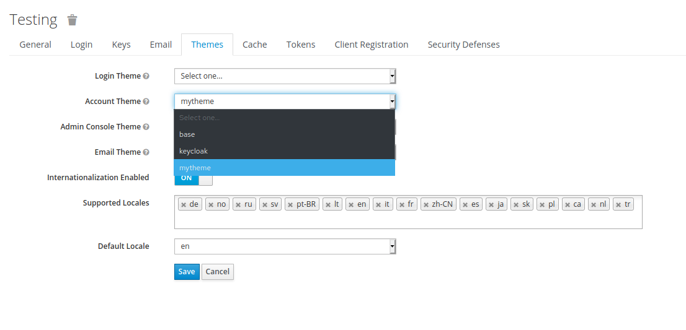

# Example of how to create a customized theme for KeyCloak and publish it as a JAR file.

## Overview
This is an example Maven project which can be packaged to provide a custom theme (or themes) for [KeyCloak](https://keycloak.org). 

## Instructions

1. Modify the `groupId`, `artifactId`, and `version` in the Maven POM file to be unique for your organization.
1. KeyCloak themes generally extend from one another, and this example extends from the `keycloak` theme which is built-in to KeyCloak.
   * If you are using Red Hat SSO, change the `parent` in `src/main/resources/theme/<theme name>/<type>/theme.properties` to be `rh-sso`.
1. Each theme can contain one or more **types** like `account`, `login`, `email`, etc...
   * Each type gets it's own subdirectory under the `src/main/resources/theme/<theme name>` directory
   * Each theme & type needs to be listed in the `src/main/resources/META-INF/keycloak-themes.json`
     ```json
     {
         "themes": [{
             "name" : "mytheme",
             "types": [ "account" ]
         }]
     }
     ```
1. Each **type** directory can contain a `messages` directory where you can place an properties file for each language you wish to support.
   * e.g. `messages_en.properties` for English, and each line is in the form of `propertyName=String Value`
1. Each **type** directory can contain a `resources` directory where you can place static content like JavaScript, images, and css.
1. Each **type** directory **MUST** have a `theme.properties` file if it is extending another theme like `keycloak` or `rh-sso`.
   * If you are writing a theme from scratch, you should not be using this starter.

## Add Your Theme To KeyCloak

1. Package your theme as a JAR file
   * `mvn clean package`
1. Copy the JAR file to `<keycloak>/standalone/deployments/`

Once this is complete and you log in to the KeyCloak admin console you will be able to select `<theme name>` from the list of options as shown below:

